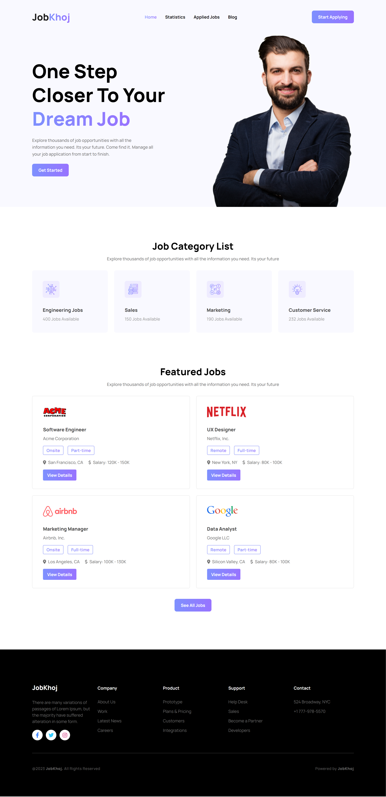
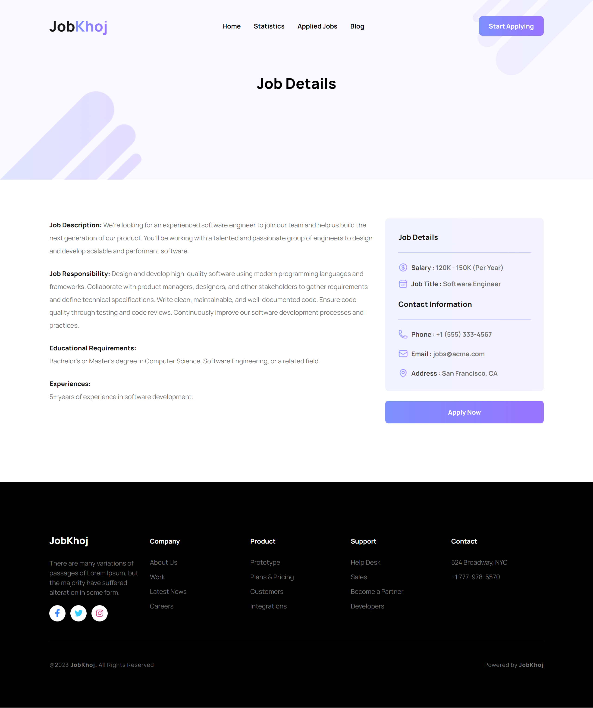
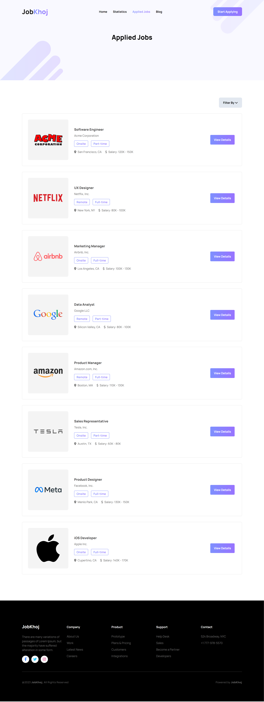
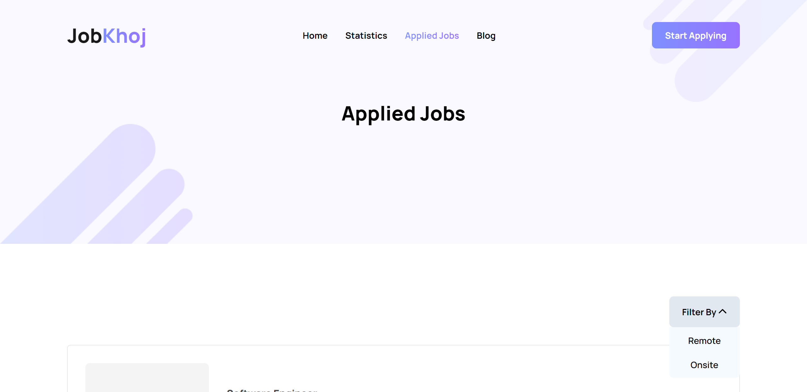
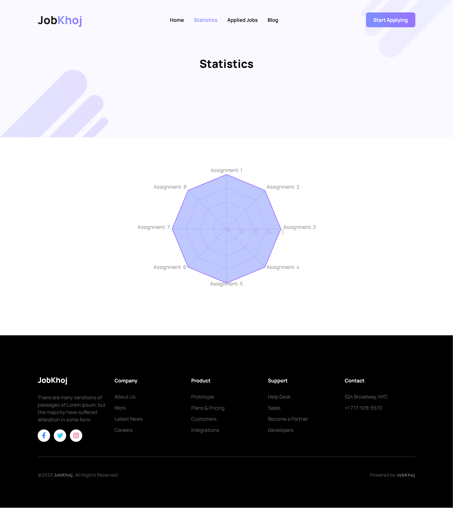
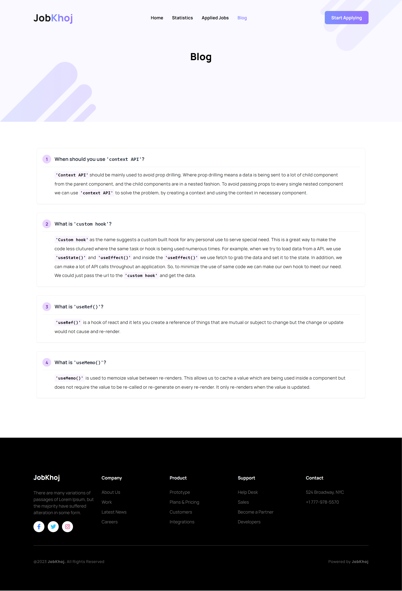

# JobKhoj

## A portal for your next job search.

### Visit Now: https://jobkhoj-topurayhan007.netlify.app/

#### Features:

- Shows top job categories
- Shows number of jobs available in each job category
- Lets you view all available jobs
- Each job circular shows the company name, postion of recruitment, part-time/full-time status, remote/onsite status, the location of the job, the offering salary range.
- You are also able to view details information about the job.
- You are able to apply for the jobs.
- You are able to view all your applied jobs.

* You will be shown success toast when you apply for a job and a warning toast when you reapply for a job.

- You are able to filter all your applied jobs by Remote or Onsite status.

* You will be able to view statistics on jobs _(work in progress)_.
* You will be able to view blog post regarding jobs _(work in progress)_.
* There is dynamic page header.
* There is active navbar items based on the page.
* Responsive in desktop and mobile devices.

